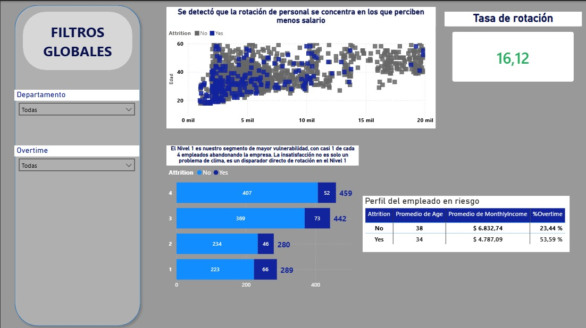
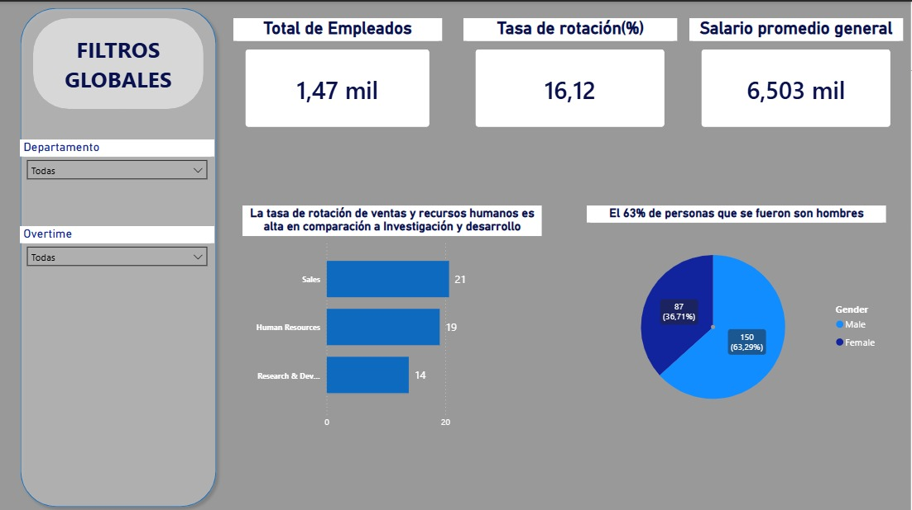

# 📊 HR Analytics: Estrategia contra la Rotación de Personal

> Este proyecto traduce datos de 1,470 empleados en **decisiones estratégicas**. El objetivo principal es desmitificar el *porqué* del abandono laboral, identificando perfiles de riesgo mediante un enfoque técnico integral (Python + SQL + BI).

---

## 📌 Contexto del Negocio
La rotación de personal (Attrition) no es solo una métrica de RRHH; es un drenaje de capital intelectual y operativo. Este análisis permite a Talento Humano pasar de un enfoque reactivo a uno **predictivo**.

---

## 🛠 Stack Tecnológico
* **Análisis y Manipulación:** `Python` con `Pandas` y `Scipy`.
* **Gestión de Datos:** `SQL` (SQLite) para consultas estructuradas.
* **Business Intelligence:** `Power BI` con lógica `DAX` avanzada.
* **Visualización:** `Matplotlib` / `Seaborn`.

---

## 🚀 Metodología Profesional
El flujo de trabajo siguió un ciclo de vida de datos estandarizado:

1. **Auditoría de Datos:** Limpieza, validación de nulos y análisis estadístico.
2. **Consultoría de Datos (SQL vs. Pandas):** Comparativa estratégica entre la agilidad de Pandas y la escalabilidad de SQL.
3. **Ingeniería de Métricas:** Creación de KPIs de rotación mediante **DAX** con alertas condicionales.
4. **Visualización Ejecutiva:** Diseño de dashboards siguiendo criterios de **UI/UX corporativo**.

---

## 📊 Hallazgos Principales (Highlights)
* **Tasa de Rotación:** 16.12% global.
* **Alerta Crítica:** Ventas presenta un **21% de rotación**, identificándose como la zona de mayor riesgo.
* **Perfil de Riesgo:** El empleado que abandona suele ser más joven, con menor salario y una carga de **horas extras (OverTime)** significativamente superior a los empleados estables.
* **Satisfacción:** La insatisfacción (Nivel 1) es un predictor directo de deserción; el segmento de Nivel 1 muestra una tasa de rotación del 22.8%.

---

## 🖥️ Dashboard Ejecutivo (Power BI)

*Dashboard diseñado bajo criterios de diseño senior (paleta de 3 colores, títulos con insights y consistencia visual).*

---

## 📂 Contenido del Repositorio
* `analisis_hr.ipynb`: Notebook con el flujo completo de exploración y análisis.
*`Dashboard_hr.ipynb`: Archivo Power BI en donde se encuentra 
* `queries_hr.sql`: Script de consultas SQL.
* `assets/`: Recursos visuales del proyecto.

---
*Desarrollado como parte del plan de formación profesional en Ciencia de Datos.*
