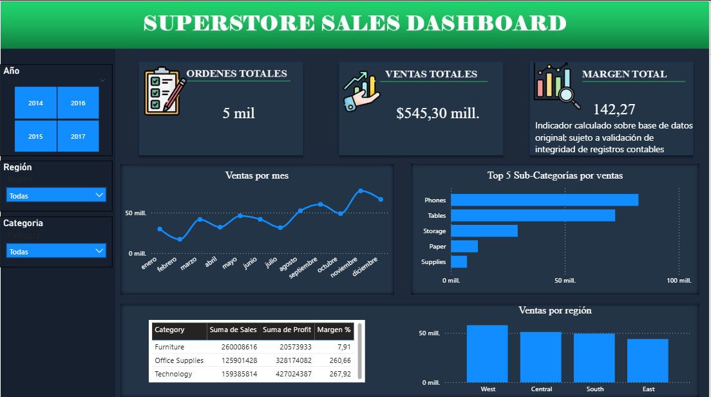

# 📊 Superstore Sales Analysis: Visión Ejecutiva de Ventas

> Este proyecto presenta un Dashboard de una sola página diseñado para la toma de decisiones estratégicas, integrando limpieza de datos, modelado dimensional con tablas de calendario y visualización avanzada en Power BI.

---

## 🎨 Decisiones de Diseño
El diseño se fundamenta en una **Visión Ejecutiva de Ventas**, priorizando la legibilidad y la jerarquía de la información. Se implementó un lienzo con enfoque corporativo, utilizando un panel lateral para segmentadores que permite una navegación intuitiva por Año, Región y Categoría.

### Paleta de Colores (Estilo Dark Mode)
Para asegurar un contraste profesional y moderno, se utilizó la siguiente paleta:
* **Fondo General:** `#1E2A3A` (Azul marino oscuro).
* **Panel de Filtros:** `#16202E`.
* **Encabezados (Header):** `#2ECC71` (Verde acento para destacar el éxito comercial).
* **Fondo de Visuales:** `#243447`.
* **Texto:** `#FFFFFF`.

---

## 🛠️ Modelado y Medidas DAX
Uno de los pilares del proyecto fue la creación de una **Tabla de Calendario** robusta para habilitar funciones de *Time Intelligence*. Se corrigió el formato de la columna `Order DATE` a tipo fecha para establecer una relación **uno a varios (1:*)** desde `Calendario[Date]` hacia la tabla de hechos.

### Documentación de Medidas
* **Calendario Dinámico:**
    ```dax
    Calendario = 
    VAR MinYear = YEAR(MIN('Tabla'[Order Date]))
    VAR MaxYear = YEAR(MAX('Tabla'[Order Date]))
    RETURN
    ADDCOLUMNS (
        CALENDAR(DATE(MinYear, 1, 1), DATE(MaxYear, 12, 31)),
        "Año", YEAR([Date]),
        "Mes", FORMAT([Date], "MMMM"),
        "MesNum", MONTH([Date]),
        "Trimestre", "T" & FORMAT([Date], "Q")
    )
    ```
* **Ventas Totales:** `SUM(Sales)`
* **Total Órdenes:** `DISTINCTCOUNT(Order ID)`
* **Margen de Ganancia %:** `DIVIDE(SUM(Profit), SUM(Sales), 0)`

---

## 🔍 Hallazgos de Negocio (Insights)

Basado en los KPIs principales y el análisis de los visuales, se identifican los siguientes puntos clave:

1.  **Ventas Totales ($545,30 M):** Se observa una tendencia de crecimiento estacional hacia el final del año (noviembre y diciembre), lo que sugiere una oportunidad para optimizar el inventario previo al Q4.
2.  **Volumen de Operación (5 mil órdenes):** La distribución por regiones muestra que el mercado 'West' lidera la generación de demanda, siendo un área crítica para mantener la excelencia logística.
3.  **Anomalía en Margen (142,27%):** **[Alerta de Calidad de Datos]** Se detectaron inconsistencias donde el *Profit* supera el valor de venta en ciertos registros. Este hallazgo invalida el cálculo de margen estándar y señala la necesidad urgente de una auditoría en los registros contables para corregir la integridad de los datos de utilidad.

---

## 🖥️ Visualización del Dashboard



---
*Desarrollado como parte del fortalecimiento de habilidades en Business Intelligence e Ingeniería Industrial.*
