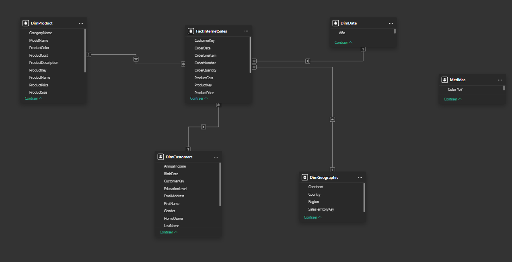

# Adventure Works: Sales Intelligence Dashboard

Este proyecto es una solución integral de análisis de datos desarrollada en **Power BI**, enfocada en la exploración de ventas, tendencias temporales y rendimiento de productos para Adventure Works.

## 🏗️ Arquitectura del Modelo (Star Schema)
El dashboard se sustenta sobre un **modelo de datos en estrella (Star Schema)**. Se realizó un proceso de limpieza y modelado donde se establecieron relaciones de **1:N (uno a muchos)** desde las tablas de dimensiones hacia la tabla de hechos (`FactInternetSales`), asegurando la integridad referencial y el correcto flujo de los filtros.

* **Tabla de Hechos:** `FactInternetSales` (Contiene las transacciones de ventas).
* **Tablas de Dimensiones:** `DimProduct`, `DimCustomers`, `DimGeographic` y `DimDate`.
* **Gestión de fechas:** Se configuró una `DimDate` personalizada con columnas calculadas (`Año`, `Nombre del Mes`, `MesNum`) para habilitar la inteligencia de tiempo (Time Intelligence) y corregir problemas de formato en el origen de datos.

## 🧮 Medidas DAX Documentadas
La lógica de negocio se implementó mediante medidas DAX para ofrecer métricas dinámicas:

* **Total Sales:** `SUM(FactInternetSales[TotalSales])`
* **Total Orders:** `DISTINCTCOUNT(FactInternetSales[OrderNumber])`
* **Total Customers:** `DISTINCTCOUNT(FactInternetSales[CustomerKey])`
* **Ventas Año Anterior:** `CALCULATE([Total Sales], SAMEPERIODLASTYEAR('DimDate'[Date]))`
* **YoY %:** `DIVIDE([Total Sales] - [Ventas Año Anterior], [Ventas Año Anterior], 0)`
* **Color YoY:** `IF([YoY %] >= 0, "#2ECC71", "#E74C3C")` *(Lógica para indicadores visuales)*

## 🎨 Decisiones de Diseño y Estética
Se optó por una interfaz de usuario orientada al **análisis profesional (Dark Mode)**, utilizando la siguiente paleta de colores Hex:

* **Fondo:** `#0F1923` (Negro azulado).
* **Panel Lateral:** `#162030`.
* **Header:** Degradado (`#1A6B8A` a `#0D4D6B`).
* **Tarjetas (KPIs):** `#1C2B3A` con bordes `#2A4A6B`.
* **Acento (Gráficos):** `#00B4D8` (Azul Cyan).
* **Alertas:** `#E74C3C` (Rojo).
Nota de diseño: Se sustituyó el KPI 'Total Customers' por 'YoY%' debido a que el análisis de crecimiento temporal aporta un mayor valor ejecutivo para la toma de decisiones estratégicas en este dashboard.

## 💡 Hallazgos de Negocio
Basado en la exploración de datos, se extrajeron dos insights clave para la toma de decisiones:

1.  **Estacionalidad en Picos de Venta:** El gráfico de tendencia muestra un incremento notable en las ventas durante **Mayo y Junio**. Se recomienda al departamento de logística ajustar los niveles de inventario y la cadena de suministro previo a estas fechas para maximizar la disponibilidad de producto.
2.  **Concentración del Portafolio:** El análisis de los productos más vendidos confirma que la línea **Mountain-200** representa el volumen mayoritario de las ventas. Existe una dependencia significativa del producto, lo que invita a considerar estrategias de cross-selling con complementos de la misma serie para incrementar el ticket promedio.

---
*Desarrollado para Adventure Works Sales Intelligence.*
